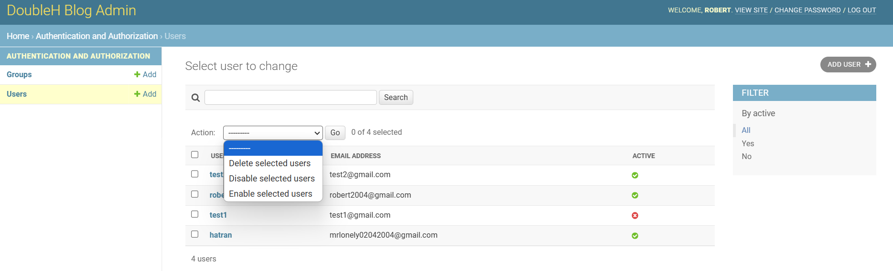
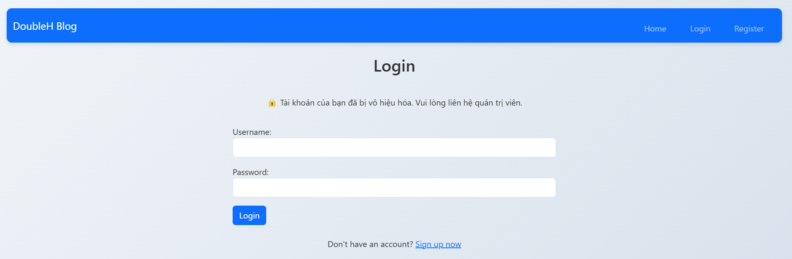
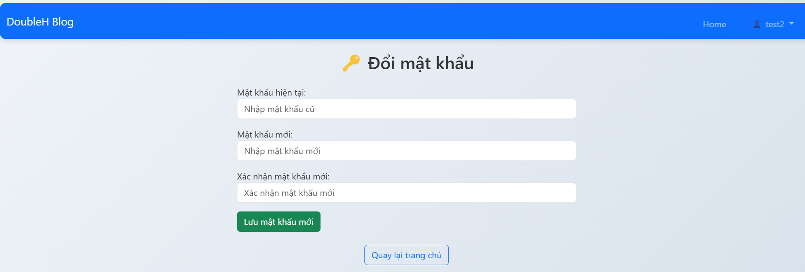
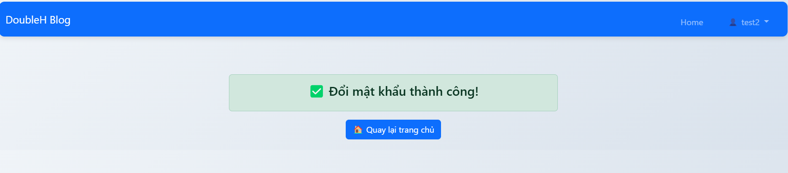

# Thêm chức năng vô hiệu hóa user, hiển thị thông báo user bị vô hiệu hóa, đặt lại mật khẩu cho user

- Vô hiệu hóa user

    

- Kết quả sau khi vô hiệu hóa user

    

- Thay đổi mật khẩu cho user

    

- Kết quả sau khi thay đổi mật khẩu cho user

    

