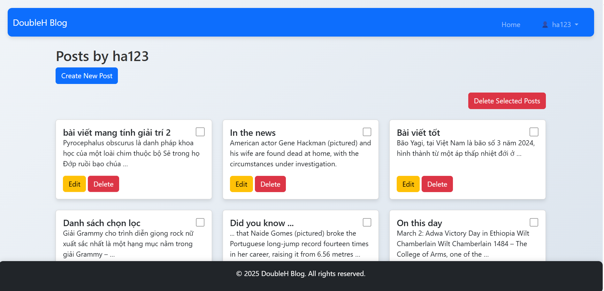
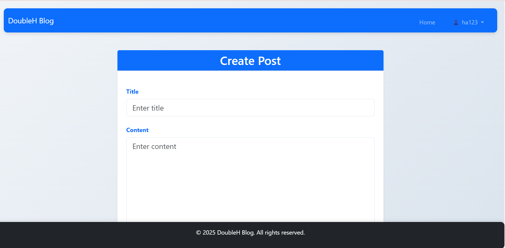
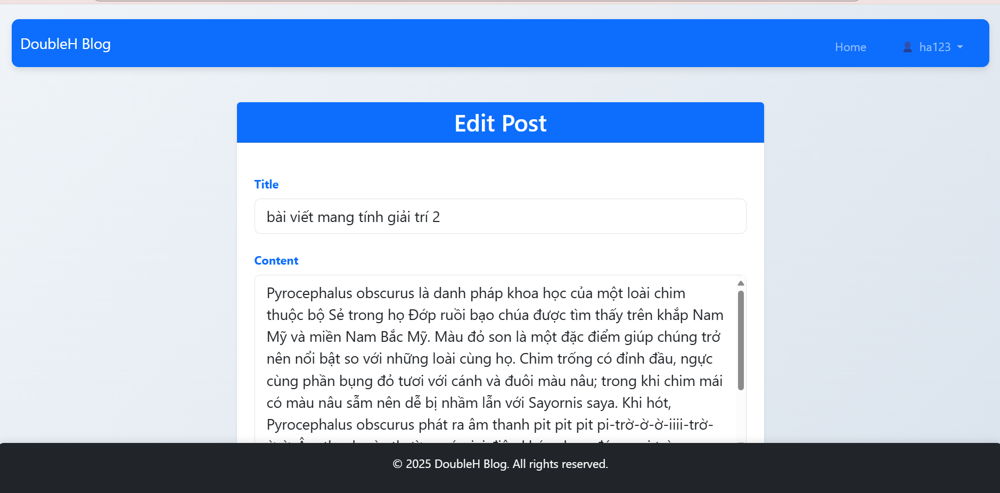
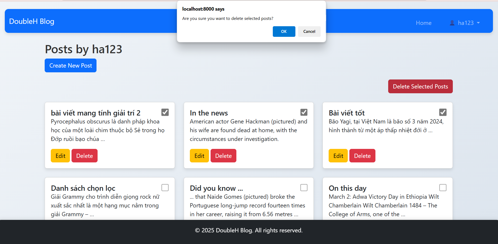

### Thêm chức năng: Cho phép user có quyền quản lý bài viết (post) hoặc nhiệm vụ (task) của mình. Hãy chỉnh sữa mã để cho phép user có thể thực hiện thao tác xóa cùng lúc trên nhiều posts/tasks cùng lúc
- Trang quản lí bài post của user:

    

- Tạo post mới:

    

- Chỉnh sửa bài post:

    

- Xóa nhiều bài post cùng lúc:

    

